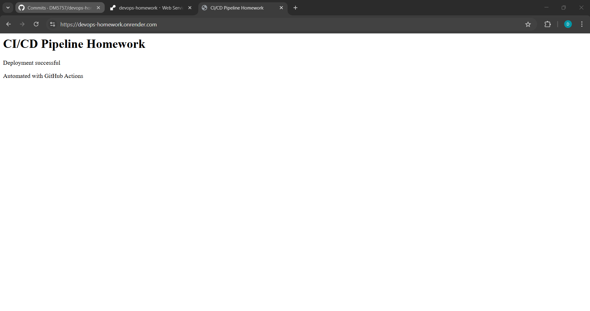
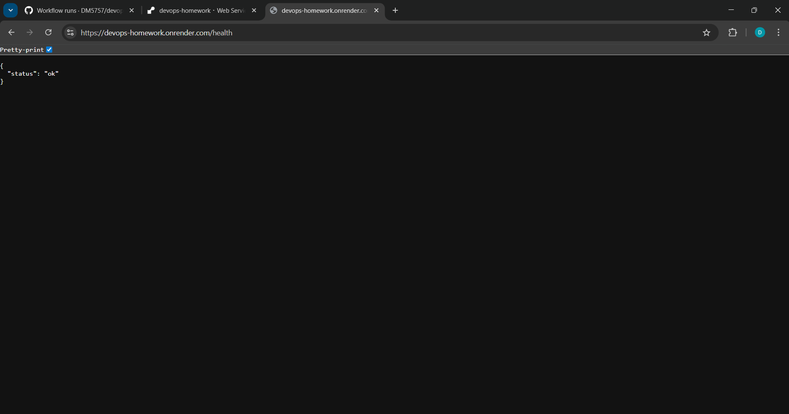
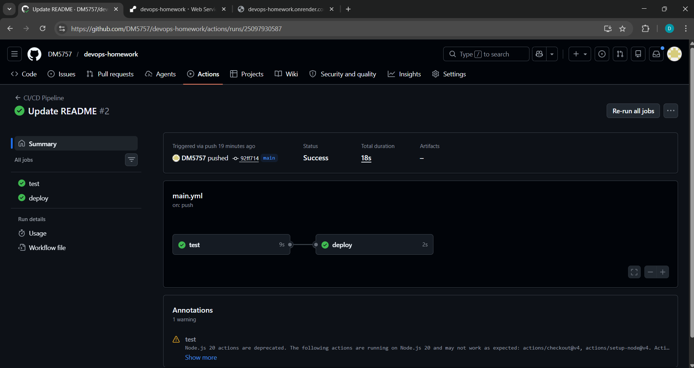

# CI/CD Pipeline Homework (Express + GitHub Actions)

## Live Application

[https://devops-homework.onrender.com/](https://devops-homework.onrender.com/)

## Screenshots

### Home Page


### Health Endpoint


### GitHub Actions Run


## Project Overview

This is a simple Node.js + Express app for practicing CI/CD pipeline automation and deployment strategies.

### CI (Continuous Integration)

Every time I push code or open a pull request, GitHub Actions runs the tests first (`npm test`). If the tests fail, it stops there.

### CD (Continuous Delivery / Deployment)

If the tests pass and it is a push to the `main` branch, the workflow starts deployment.

## Deployment Strategy: Rolling Deployment

The chosen strategy is **Rolling Deployment**. With this approach, Render redeploys the service while keeping it available, so downtime is usually minimal.

Deployment only starts **after** GitHub Actions confirms the tests pass, so broken changes should not go live.

## CI/CD Pipeline Flow

- I push code to GitHub (main branch)
- GitHub Actions starts automatically
- It installs dependencies
- It runs tests
- If tests pass, deployment starts
- GitHub Actions triggers Render using deploy hook
- Render updates the live app

## Rollback Guide (Render)

1. Open Render Dashboard  
2. Select the service  
3. Go to Deploys  
4. Choose the previous successful deploy  
5. Click Rollback / Redeploy previous deploy  
6. Verify the live app and `/health` route

## Local Development

Install dependencies and run the app locally:

```bash
npm install
npm start
```

Run tests:

```bash
npm test
```